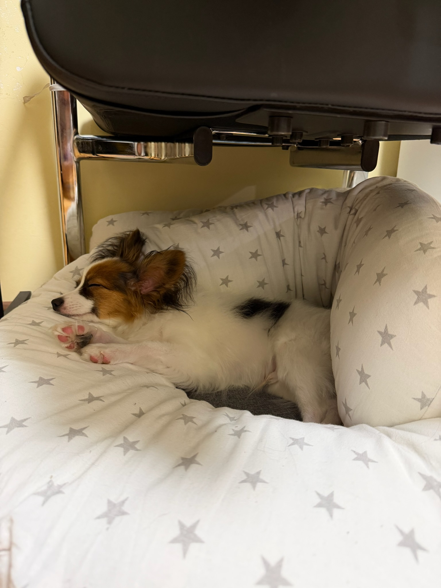

# About me

Hi! I'm Maria.

I am currently learning Python and GitHub and working on educational projects.

I enjoy discovering new technologies and improving my coding skills step by step.

I also love traveling and dogs 🐶✈️

